# Azure Resilient Web App Infrastructure

A hands-on Azure infrastructure project demonstrating enterprise-grade architecture using Infrastructure as Code (Bicep + ARM) and PowerShell automation. Built to simulate a real-world, highly available web application environment — covering networking, compute, storage, backup, monitoring, and secure access.

---

## Architecture Overview

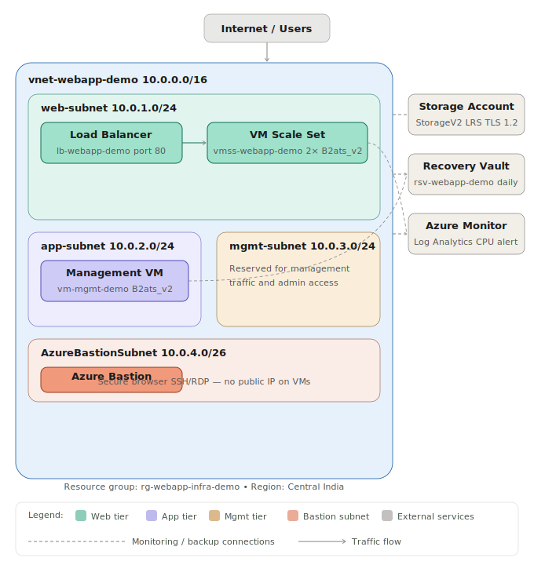

---

## What This Project Covers

| Component | Resource | Purpose |
|---|---|---|
| Networking | VNet + 4 subnets | Isolated network tiers (web, app, mgmt, bastion) |
| Load Balancing | Azure Standard Load Balancer | Distributes HTTP traffic across VMSS instances |
| Compute | VM Scale Set (2× B2ats_v2) | Auto-scalable web tier with health probes |
| Management VM | Standalone VM (B2ats_v2) | Dedicated VM for backup/restore demo |
| Storage | Azure Storage Account (StorageV2, LRS) | Secure storage with TLS 1.2, public access disabled |
| Backup | Recovery Services Vault + daily policy | VM disk backup with 7-day retention |
| Monitoring | Azure Monitor + Log Analytics | CPU metrics, alerts, and log ingestion |
| Secure Access | Azure Bastion (Basic SKU) | Browser-based SSH/RDP without public IPs on VMs |

---

## Architecture Decisions

**Why Bicep over Terraform?**
This project targets Azure-specific roles (Azure Administrator, IAM Engineer) where Bicep is the native, preferred IaC tool. Bicep compiles directly to ARM, is Microsoft-maintained, and produces cleaner syntax for Azure-only deployments than a multi-cloud tool would.

**Why a standalone Management VM alongside VMSS?**
Azure Backup's standard PowerShell cmdlets do not support enrolling Uniform-mode VMSS instances directly into a Recovery Services Vault. A standalone VM was added to the `app-subnet` specifically to demonstrate a realistic backup and restore workflow — a deliberate architectural decision, not a workaround.

**Why three subnet tiers?**
Separating web, app, and mgmt subnets reflects enterprise network segmentation best practices — each tier can have its own NSG rules, restricting lateral movement between layers. The `AzureBastionSubnet` follows Azure's mandatory naming convention for Bastion deployments.

---

## Repository Structure

```
azure-resilient-webapp-infra/
├── README.md
├── .gitignore
├── bicep/
│   ├── main.bicep
│   └── modules/
│       ├── network.bicep          # VNet, subnets (web, app, mgmt, AzureBastionSubnet)
│       ├── loadbalancer.bicep     # Standard LB, public IP, health probe, LB rule
│       ├── vmss.bicep             # VM Scale Set, NIC config, backend pool attachment
│       ├── storage.bicep          # StorageV2, Standard LRS, TLS 1.2
│       ├── backup.bicep           # Recovery Services Vault, daily backup policy
│       ├── managementvm.bicep     # Standalone VM for backup/restore demo
│       ├── monitor.bicep          # Log Analytics workspace, CPU metric alert
│       └── bastion.bicep          # Azure Bastion host, dedicated public IP
├── arm/                           # ARM template exports (Bicep comparison reference)
├── scripts/
│   └── deploy.ps1                 # PowerShell deployment script
└── docs/
    └── architecture-diagram.svg   # Architecture diagram
```

---

## Deployment Guide

### Prerequisites
- Azure subscription (student or pay-as-you-go)
- PowerShell with Az module installed (`Install-Module -Name Az`)
- Azure Bicep CLI installed (`az bicep install`)
- VS Code with Bicep extension (recommended)

### Step 1 — Authenticate
```powershell
Connect-AzAccount
$resourceGroup = "rg-webapp-infra-demo"
$location = "centralindia"
```

### Step 2 — Create Resource Group
```powershell
New-AzResourceGroup -Name $resourceGroup -Location $location
```

### Step 3 — Deploy each module
```powershell
# Network
New-AzResourceGroupDeployment -ResourceGroupName $resourceGroup -TemplateFile "bicep/modules/network.bicep"

# Load Balancer
New-AzResourceGroupDeployment -ResourceGroupName $resourceGroup -TemplateFile "bicep/modules/loadbalancer.bicep"

# VMSS (requires subnet and backend pool IDs from previous deployments)
$webSubnetId = (Get-AzVirtualNetwork -ResourceGroupName $resourceGroup -Name "vnet-webapp-demo").Subnets[0].Id
$backendPoolId = (Get-AzLoadBalancer -ResourceGroupName $resourceGroup -Name "lb-webapp-demo").BackendAddressPools[0].Id
New-AzResourceGroupDeployment -ResourceGroupName $resourceGroup `
  -TemplateFile "bicep/modules/vmss.bicep" `
  -webSubnetId $webSubnetId `
  -backendPoolId $backendPoolId `
  -adminPassword (ConvertTo-SecureString "YourPassword" -AsPlainText -Force)

# Storage
New-AzResourceGroupDeployment -ResourceGroupName $resourceGroup -TemplateFile "bicep/modules/storage.bicep"

# Backup
New-AzResourceGroupDeployment -ResourceGroupName $resourceGroup -TemplateFile "bicep/modules/backup.bicep"

# Management VM
$appSubnetId = (Get-AzVirtualNetwork -ResourceGroupName $resourceGroup -Name "vnet-webapp-demo").Subnets[1].Id
New-AzResourceGroupDeployment -ResourceGroupName $resourceGroup `
  -TemplateFile "bicep/modules/managementvm.bicep" `
  -appSubnetId $appSubnetId `
  -adminPassword (ConvertTo-SecureString "YourPassword" -AsPlainText -Force)

# Monitor
$vmssId = (Get-AzVmss -ResourceGroupName $resourceGroup -VMScaleSetName "vmss-webapp-demo").Id
New-AzResourceGroupDeployment -ResourceGroupName $resourceGroup `
  -TemplateFile "bicep/modules/monitor.bicep" `
  -vmssResourceId $vmssId

# Bastion
New-AzResourceGroupDeployment -ResourceGroupName $resourceGroup -TemplateFile "bicep/modules/bastion.bicep"
```

---

## Backup & Restore Demo

One of the key demonstrations in this project is a complete backup and restore workflow:

1. **Enrolled** `vm-mgmt-demo` into the Recovery Services Vault with a daily backup policy
2. **Triggered** an on-demand backup via PowerShell
3. **Simulated corruption** — created a test file (`/important-config.txt`) to represent a config change post-backup
4. **Restored** the VM from the recovery point (file-system consistent snapshot)
5. **Verified** — the restored VM did not contain the post-backup file, confirming the restore point was clean

```powershell
# Trigger on-demand backup
$vault = Get-AzRecoveryServicesVault -ResourceGroupName $resourceGroup -Name "rsv-webapp-demo"
Set-AzRecoveryServicesVaultContext -Vault $vault
$policy = Get-AzRecoveryServicesBackupProtectionPolicy -Name "daily-backup-policy"
$item = Get-AzRecoveryServicesBackupItem -BackupManagementType AzureVM -WorkloadType AzureVM -VaultId $vault.ID -Name "vm-mgmt-demo"
Backup-AzRecoveryServicesBackupItem -Item $item -VaultId $vault.ID
```

---

## Monitoring Setup

- **Log Analytics Workspace** (`log-webapp-demo`) collects metrics from VMSS
- **CPU Alert Rule** fires when average CPU exceeds 80% over a 15-minute window, evaluated every 5 minutes
- **Azure Monitor Insights** enabled on VMSS for host-level CPU, disk, and availability metrics

---

## Cost Management Notes

This project was built on an Azure Student subscription ($100 credit). Key cost controls applied:
- Used `Standard_B2ats_v2` (burstable, AMD-based) — lowest available SKU with no capacity restrictions in Central India
- VMSS instances deallocated overnight to stop compute billing
- Azure Bastion deployed only for demo duration, then deleted (`~$0.19/hr` Basic SKU)
- Storage Account uses Standard LRS (cheapest replication tier)
- Log Analytics on `PerGB2018` pay-per-use with 30-day minimum retention

---

## Skills Demonstrated

- Azure Virtual Networking (VNet, subnets, NSGs, CIDR/subnetting)
- Infrastructure as Code with Bicep (modular, parameterized templates)
- Azure Compute (VM Scale Sets, standalone VMs, B-series sizing)
- Azure Backup and Recovery Services Vault
- Azure Monitor, Log Analytics, and metric alert rules
- Azure Bastion for secure, agentless VM access
- PowerShell Az module for deployment and resource lifecycle management
- Git version control with commit-per-resource workflow

---

## Author

**Saalim Khan** — Systems Engineer | IAM & Azure Cloud  
[LinkedIn](https://www.linkedin.com/in/saalim-khan-9b16272a3) | saalimk110@gmail.com

---

## Screenshots

### Load Balancer with Health Probe
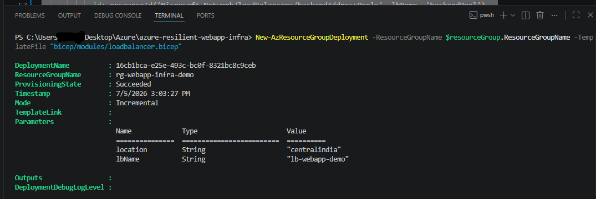

### VM Scale Set — 2 Instances Running
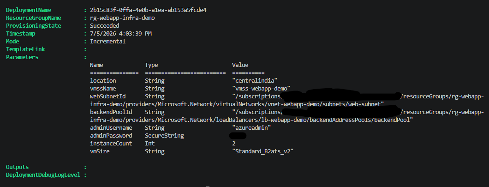

### Storage Account — Public Access Disabled
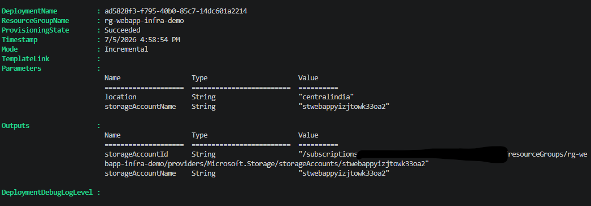

### Backup Job — Completed Successfully
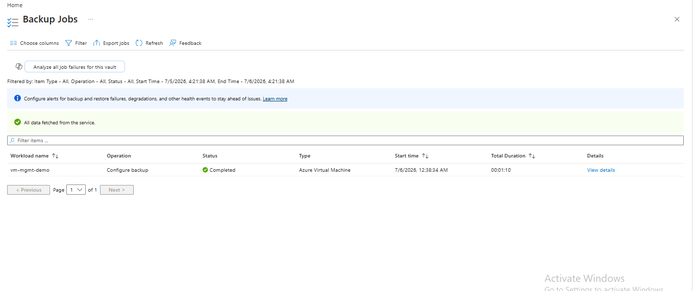

### Backup Job on powershell — Completed Successfully 
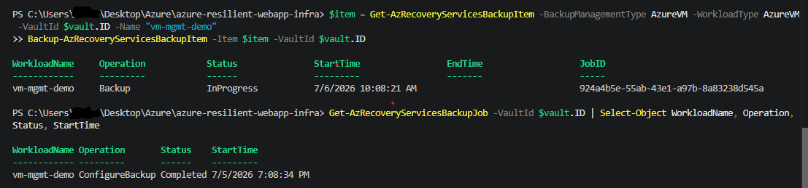

### Before Restore — Corrupted File Present
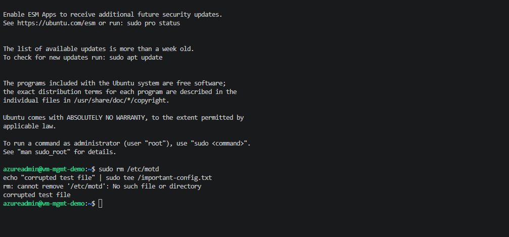

### After Restore — File Absent, VM Clean
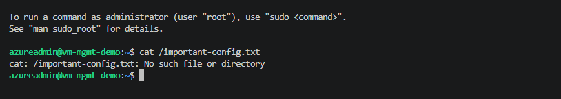

### Azure Monitor — CPU Metrics Graph
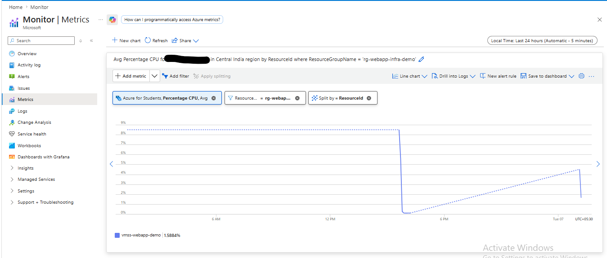

### Alert Rule — CPU Threshold Configured
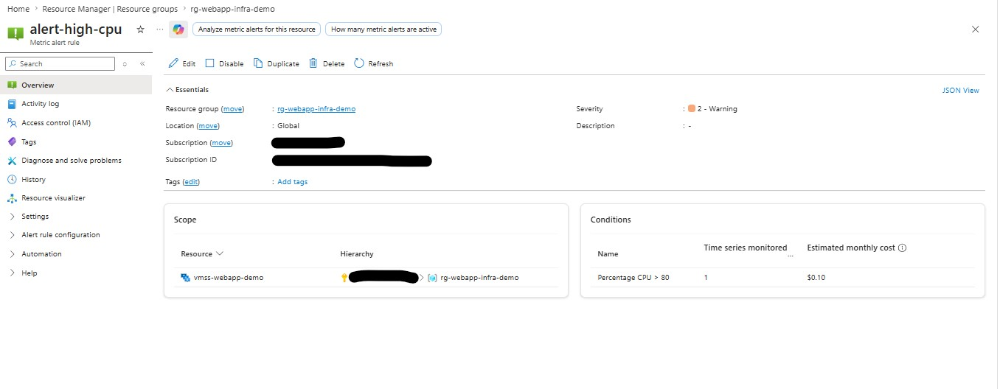

### Azure Bastion — Setup Successfull
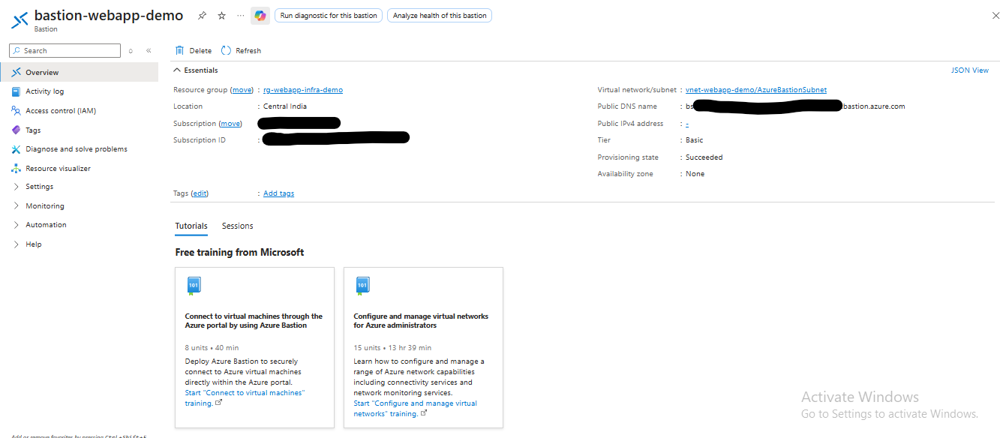

### Azure Bastion — Secure Browser SSH Connection
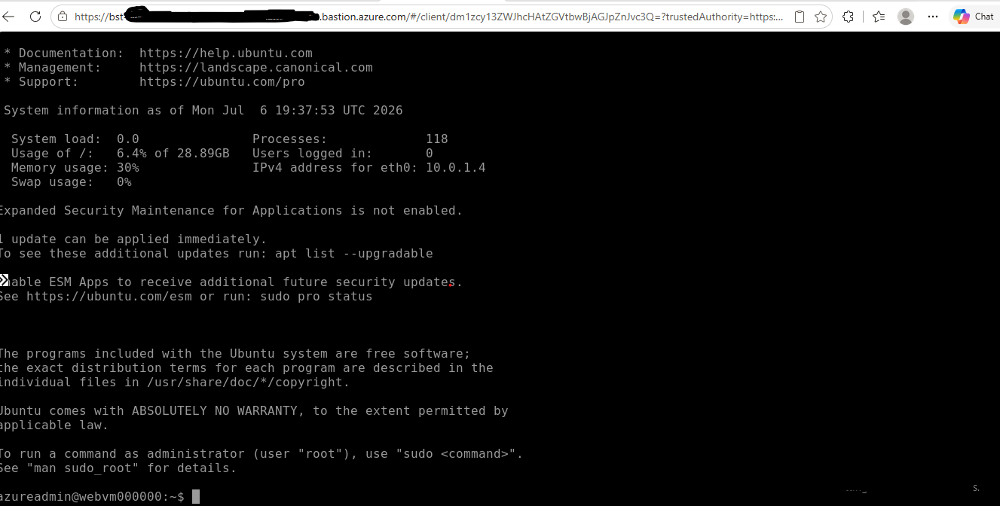
